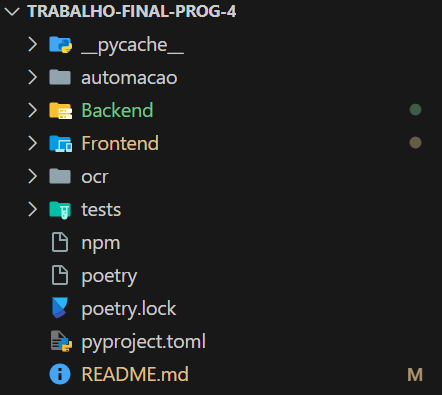

<h1> 📌 Projeto Fullstack - Frontend + Backend </h1>

Este projeto é dividido em duas partes principais:

Frontend → interface do usuário (React + typescript, Tailwind).

Backend → API e regras de negócio (Node.js, Python).

<h2> 📂 Estrutura de Pastas </h2>

🚀 Pré-requisitos

Certifique-se de ter instalado em sua máquina:

Node.js
 (versão recomendada: LTS)

pnpm ou yarn ou pnm

<h2> ▶️ Como rodar o Backend </h2>

* Acesse a pasta do backend:

cd backend

* Instale as dependências:

npm install

* Configure as variáveis de ambiente (arquivo .env):

PORT=5000
DATABASE_URL=...

* Inicie o servidor:

npm run start

O backend estará disponível em: http://localhost:5173

<h2> ▶️ Como rodar o Frontend </h2>

* Acesse a pasta do frontend:

cd frontend

* Instale as dependências:

npm install

* Configure a URL da API no arquivo de ambiente (ex: .env):

VITE_API_URL=http://localhost:5173

* Inicie a aplicação:

npm run dev

O frontend estará disponível em: http://localhost:5173

<h2> 🔗 Fluxo de Execução </h2>

Inicie o backend para que a API esteja disponível.

Em seguida, inicie o frontend.

A aplicação consumirá os dados do backend e renderizará na interface.

📜 Scripts comuns
Backend

npm run dev → roda o servidor em modo desenvolvimento

npm run start → roda o servidor em produção

Frontend

npm run dev → roda o app em modo desenvolvimento

npm run build → gera os arquivos para produção

npm run preview → simula o app em produção localmente

✅ Observações

Caso utilize Docker, é possível criar um docker-compose.yml para rodar frontend, backend e banco de dados juntos.

Se o backend rodar em outra porta, ajuste a variável API_URL no frontend.